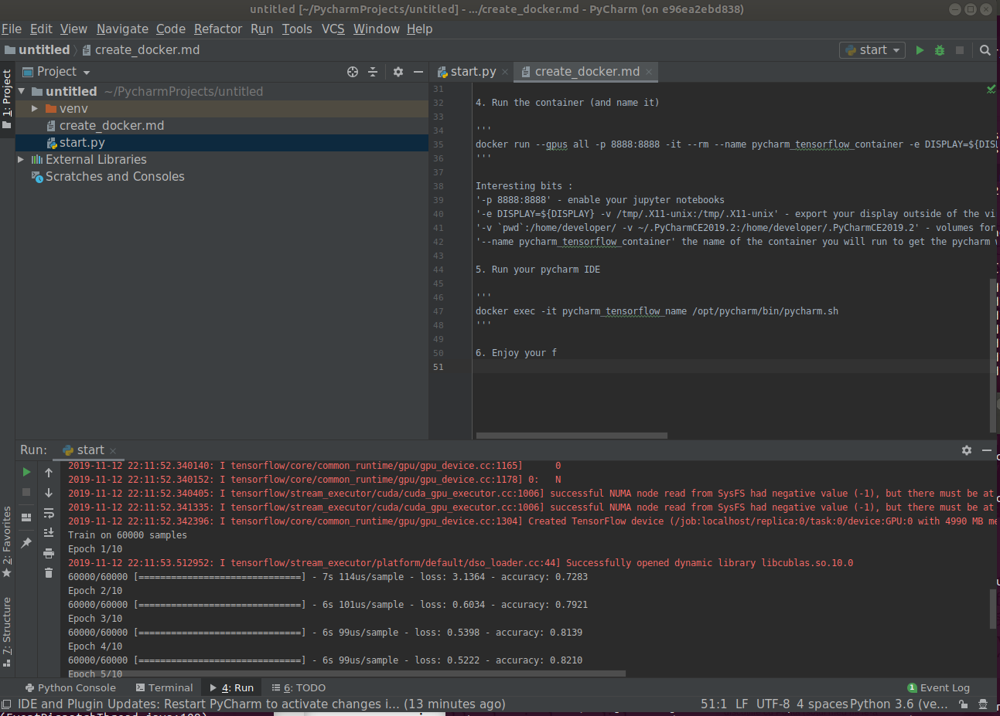

# How to use Pycharm CE with a tensorflow2_gpu docker image

This small project shows how to make a docker image containing tensorflow2_gpu and exposing PyCharm and jupyter notebooks.

## Intro 
Since tensorflow2, google decided to recommend a docker image as the easyiest way to enable gpu support(essential if you do anything related to Deep Learning).
Still, to connect to that docker image with my favorite IDE (pycharm), you need the entreprise edition (the Comunity Edition does not have a remote conection).
Here, we create a docker image containing the PyCharm CE and expose it by tunneling the xserver of the docker.

## Step to create and run your docker image 


1. Follow tensorflow doc to be able to run [tensorflow_gpu container]( https://www.tensorflow.org/install/docker )
2. Create your Dockerfile (also in [this file](Dockerfile))
```
FROM tensorflow/tensorflow:latest-gpu-py3-jupyter
RUN pip3 install py4j
# JAVA and PYTHON
RUN apt-get update && apt-get install --no-install-recommends -y \
  openjdk-8-jre \
  gcc git openssh-client less curl \
  libxtst-dev libxext-dev libxrender-dev libfreetype6-dev \
  libfontconfig1 libgtk2.0-0 libxslt1.1 libxxf86vm1 \
  && apt-get clean \
  && rm -rf /var/lib/apt/lists/* \
  && useradd -ms /bin/bash developer

WORKDIR /opt/pycharm

ARG pycharm_source=https://download.jetbrains.com/python/pycharm-community-192.6603.24.tar.gz

RUN curl -fsSL $pycharm_source -o /opt/pycharm/installer.tgz \
  && tar --strip-components=1 -xzf installer.tgz \
  && rm installer.tgz \
  && /usr/bin/python3 /opt/pycharm/helpers/pydev/setup_cython.py build_ext --inplace

USER developer
```

3. Build your Docker image (do not forget the dot "." - i.e. current directory)
```docker build -t pycharm_tensorflow .```

4. Run the container (and name it)

```
docker run --gpus all -p 8888:8888 -it --rm --name pycharm_tensorflow_container -e DISPLAY=${DISPLAY} -v /tmp/.X11-unix:/tmp/.X11-unix -v `pwd`:/home/developer/ -v ~/.PyCharmCE2019.2:/home/developer/.PyCharmCE2019.2  -p 4040:4040 pycharm_tensorflow
```

Interesting bits :
`-p 8888:8888` - enable your jupyter notebooks

`-e DISPLAY=${DISPLAY} -v /tmp/.X11-unix:/tmp/.X11-unix` - export your display outside of the virtual machine

`-v `pwd`:/home/developer/ -v ~/.PyCharmCE2019.2:/home/developer/.PyCharmCE2019.2` - volumes for the code and for the Pycharm configuration

`--name pycharm_tensorflow_container` the name of the container you will run to get the pycharm window

5. Run your pycharm IDE

```
docker exec -it pycharm_tensorflow_name /opt/pycharm/bin/pycharm.sh
```

6. Enjoy your first training using Pycharm from the docker in your local ubuntu desktop:



Thanks to Bejamin Tan for the [Spark version](https://benjamintan.io/blog/2019/09/22/using-pycharm-ce-in-docker-for-great-good/)
